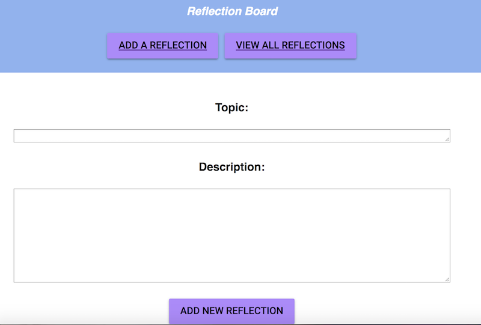
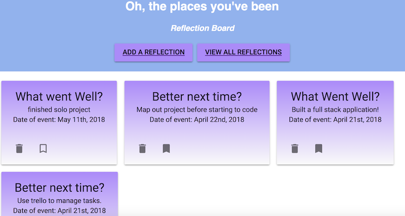

# OH, THE PLACES WE'VE BEEN

This application was completed with React using reducers and sagas, SQL, Express, and Node.js. This was the final (seventh) weekend project at Prime Digital Academy.

This application allows a user to enter in a new reflection and view all reflections. Users are able to delete and bookmark reflections. Reflections can be about professional experiences - the successes and learning opportunities from working on a group project - or personal experiences - the ups and downs of learning how to cook.

### ADD A REFLECTION

The "Add a Reflection" link allows a user to add a new reflection. A user enters a new reflection topic and description. The date is automatically added to the reflection and database when the user submits a reflection. In addition, there will be icons to delete and bookmark the reflection. Reflection are not bookmarked on submission.



### VIEW ALL REFLECTIONS

"View All Reflections" will show all of a user's reflections; they are ordered from newest to oldest. A user can delete a reflection by clicking the trashcan icon; a dialog box will promp a user to confirm they would like to delete the reflection. A user can bookmark a reflection but clicking on the bookmark icon. Bookmarked reflections will display as solid bookmarks, while un-bookmarked reflections display with only the bookmark boarder.



## Technologies Used

This application was created with the following:
* React
* React-Redux
* Node.js
* Express
* SQL
* Material UI
* Moment.js

## Setup Instructions

* Run `npm install`
* Run `npm run server`
* Run `npm run client`
* You should be automatically directed to `localhost:3000`. If this does not happen, navigate to `localhost:3000`.

## Create the Database and Table with PostgreSQL

Create a new database called `reflection_board` and a table called `reflection`.

Database and table information is prodivide in the `data.sql` file. Start the server.

```SQL
CREATE TABLE "reflection" (
  "id" serial primary key,
  "topic" varchar(120),
  "description" varchar(480),
  "bookmarked" boolean default false,
  "date" date not null default CURRENT_DATE
);
```
Sample data is available in data.sql file.

## FUTURE FEATURES
 
 Future features I would like to add to the project include
- Deploy this project to Heroku.
- Allow users to to update an existing reflection.
- Ability to filter reflections based on topic.
