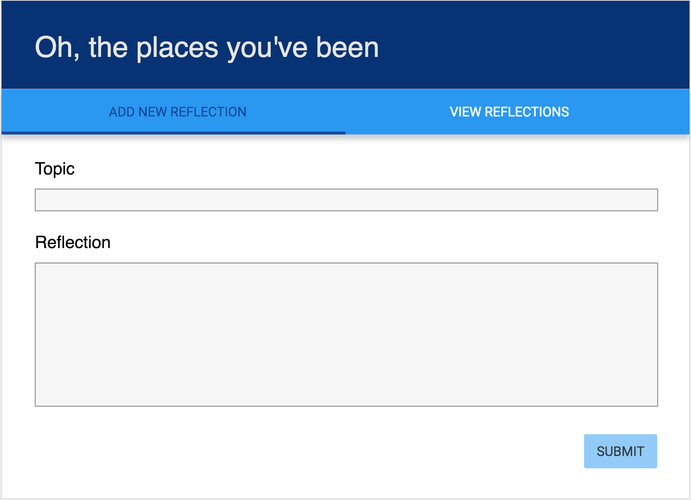
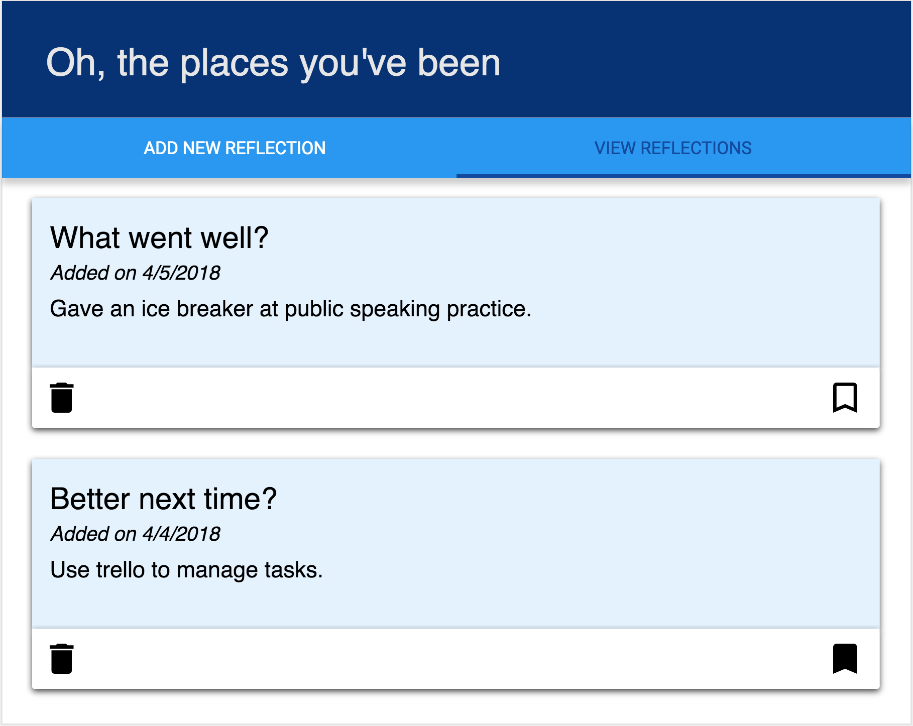

# OH, THE PLACES WE'VE BEEN

Reflection is an important part of building applications and working with a team. It's common to have a retrospective on a bi-weekly basis during a project and at the end of a project. This application allows the user to enter in a new reflection and view all reflections. Users are able to delete reflections that may no longer be relevant and bookmark favorite reflections.

This project was created using React.js, Express, SQL, Node.js, and Material-UI.


### SETUP

Database and table information is prodivide in the `data.sql` file. Start the server.

```
npm install
npm run server
```

Now that the server is running, open a new terminal tab with `cmd + t` and start the react client app.

```
npm run client
```

### TO ADD A NEW REFLECTION

Click on the "Add a reflection link". You can enter in a new reflection topic and description.  The date is automatically entered and all new reflections are not bookmarked on submission.



### TO VIEW ALL REFLECTIONS

The "View all reflections" will show all reflections; they are ordered from newest to oldest. You are able to delete a reflection by clicking the track icon. You can bookmark a reflection but clicking on the bookmark icon. Bookmarked reflections will display as solid bookmarks, while un-bookmarked reflections display with the bookmark boarder.



## FUTURE FEATURES
 
 Future features I would like to add to the project include
- Deploy this project to Heroku.
- Add additional styling elements - specifically cards and a nav bar.
- Allow users to to update an existing reflection.
- Ability to filter reflections based on topic.
